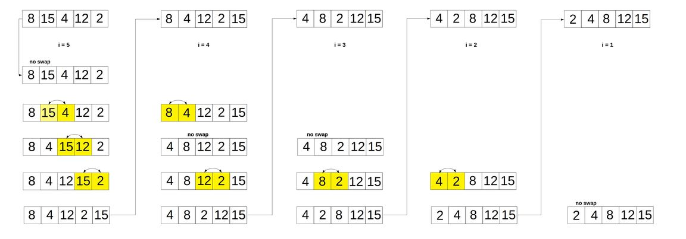

# Bubble Sort Algorithm

## Description

The bubble sort algorithm sorts a list by comparing adjacent items and swapping if their order is incorrect. The name signifies that smaller items are "bubbling" up to the top. Another way to put it is that larger items are "sinking" to the bottom.

## Implementation

### Overview

Create an outer loop that loops over the entire array. Create an inner loop that again loops over the entire array and performs a swap if two items are in incorrect order. When the inner loop has ended, an item will have reached its correct place in the list. The outer loop will decrement, shrinking the sorting "window", and the inner loop will start again. This process is repeated until all items are in their correct place.

### Pseudocode

- Create a swapping helper function
- Create an outer loop that loops from the end of the array to the start. This will create a window that shrinks by decrementing `i`.
- Create an inner loop that loops through the entire array till the end of the window above.
  - If an item is greater than the one in the next position, swap their positions.
- Return the array.

### Code

```javascript
function swap(arr, i, j) {
  let temp = arr[i];
  arr[i] = arr[j];
  arr[j] = temp;
}

function bubbleSort(arr) {
  for (let i = arr.length; i > 0; i--) {
    for (let j = 0; j < i - 1; j++) {
      if (arr[j] > arr[j + 1]) {
        swap(arr, j, j + 1);
      }
    }
  }
  return arr;
}
```

#### Diagram


