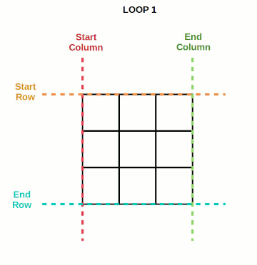

# Matrix Spiral

Create a function that given integer n returns an n \* n spiraling matrix.

```javascript
//  matrix(3)
//
//  [[1, 2, 3],
//  [8, 9, 4],
//  [7, 6, 5]]

//  matrix(4)
//
//   [[1,   2,  3, 4],
//   [12, 13, 14, 5],
//   [11, 16, 15, 6],
//   [10,  9,  8, 7]]
```

### Overview

Initiate the matrix by pushing n number of arrays into an array.

Create a counter variable to keep track of the number we're adding to the matrix.

Create variables for columns and rows boundaries at their start and end.

Create an outer loop that runs while the starting column and starting row are less than or equal to their ending counterparts.

- Create an inner loop for each side of the matrix starting clockwise for the first side:
  - Loop and add the counter value to the side of the matrix. Increment the counter variable at each loop.
  - "Shrink" that side's boundary.

It can help to see an animation of this process in effect:



### Code

```javascript
function matrix(n) {
  const results = [];

  for (let i = 0; i < n; i++) {
    results.push([]);
  }

  let counter = 1;
  let startColumn = 0;
  let endColumn = n - 1;
  let startRow = 0;
  let endRow = n - 1;
  while (startColumn <= endColumn && startRow <= endRow) {
    // Top row
    for (let i = startColumn; i <= endColumn; i++) {
      results[startRow][i] = counter;
      counter++;
    }
    startRow++;

    // Right column
    for (let i = startRow; i <= endRow; i++) {
      results[i][endColumn] = counter;
      counter++;
    }
    endColumn--;

    // Bottom row
    for (let i = endColumn; i >= startColumn; i--) {
      results[endRow][i] = counter;
      counter++;
    }
    endRow--;

    // start column
    for (let i = endRow; i >= startRow; i--) {
      results[i][startColumn] = counter;
      counter++;
    }
    startColumn++;
  }

  return results;
}
```
