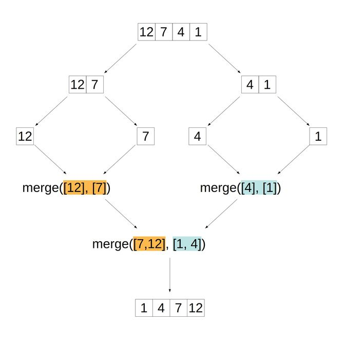

# Merge Sort

## Description

Sorts a list (array) by splitting it down to single or zero element arrays and then recursively merging. Uses a divide and conquer approach and explots the face that a single or zero element array is always sorted.

## Implementation

### Helper Function

#### Description

Accepts two sorted arrays and returns a single sorted array.

#### Overview

The function compares elements in two arrays and adds the smaller of the two to the merged array. This process continues until both arrays have been completely looped over.

In the case where one array is longer than the other or when the loop finishes in one array first, the remaining elements in the other array are “chopped” off and added the merged array.

#### Pseudocode

- Create an empty array to be used to return the final merged array.
- Create an index counter for the first array (`i`) and the second (`j`).
- Loops over arrays until either one of them has been exhausted.
- First checks to see if either array has been exhausted. If true merges the slice of the other array that hasn't been yet been merged.
- Checks which current value is smaller, push that value to the merged array. Increments the index tracking the array whose element we just pushed.
- Finally, returns the merged array.

#### Code

```javascript

function merge(arr1, arr2) {
  const merged = [];
  let i = 0, j = 0;

  while (i < arr1.length || j < arr2.length) {
    if (i === arr1.length && j < arr2.length) {
      return merged.concat(arr2.slice(j, arr2.length));
    }
    if (j === arr2.length && i < arr1.length) {
      return merged.concat(arr1.slice(i, arr1.length));
    }

    if (arr1[i] < arr2[j]) {
      merged.push(arr1[i]);
      i++;
    } else {
      merged.push(arr2[j]);
      j++;
    }
  return merged;
}
```

### Merge Sort Function

#### Description

Recursively split array in half. Return the array when length is less than one.

#### Overview

The mergeSort function will take the array and continually split it in half until only one element remains (this is the condition that stops the function from further calling itself recursively).

Once the exit condition is met, the merge function is called and then that particular function call is popped off the stack. This continues to gradually merge all the arrays that were split earlier.

This process of recursively merging the split arrays continues until we return the final, sorted array.

#### Pseudocode

- Check if `arr.length <= 1`. If so return arr.
- Find the middle index in the array.
- Call mergeSort (recursively) on the first half.
- Call mergeSort (recursively) on the second half.
- return the result of merge of the split halves: `merge(halfOne, halfTwo)`.

#### Code

```javascript
function mergeSort(arr) {
  if (arr.length <= 1) return arr;

  let middle = Math.floor(arr.length / 2);
  let halfOne = mergeSort(arr.slice(0, middle));
  let halfTwo = mergeSort(arr.slice(middle));

  return merge(halfOne, halfTwo);
}
```

#### Diagram


