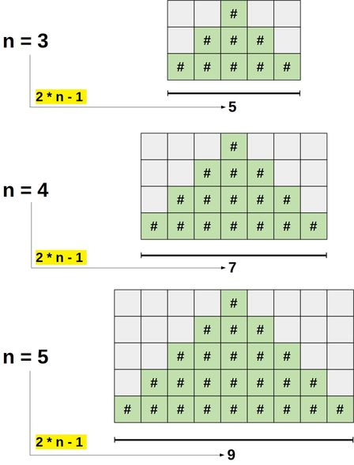

# Pyramid

The function should print a pyramid of `n` height made up of the `#` symbol and spaces to the left and right.

```javascript
//  pyramid(1)
//
//  '#'

//  pyramid(2)
//
//  ' # '
//  '###'

//  pyramid(3)
//
//  '  #  '
//  ' ### '
//  '#####'
```

### Overview

We can observe two pattern that helps us to determine the length of pyramid row and the placement of the `#`'s and spaces:

- The length of each row is equal to `2 * n - 1` (also is the number of columns in a row)
- Given a midpoint in any row, `midpoint - row` and `midpoint + row` indicates where `#`'s should be.



### Code

```javascript
function pyramid(n) {
  const midpoint = Math.floor((2 * n - 1) / 2);

  for (let row = 0; row < n; row++) {
    let level = "";

    for (let column = 0; column < 2 * n - 1; column++) {
      if (column < midpoint - row || column > midpoint + row) {
        level += " ";
      } else {
        level += "#";
      }
    }

    console.log(level);
  }
}
```

### Recursive Alternative

The function should take in three parameters: n, row and level (the empty string being built up to represent each level of the pyramid).

The function should recursively call itself until exit condition is met: n is equal to row (row will be 0 indexed). `level.length` will act as the index for each column.

At every call:

- Check for exit condition `row === n`
- If `n === stair.length` that is when have the entire row (stair) ready to be printed.
  - Print the level
  - Call the function recursively starting at the next row. Start with an empty string.
- Otherwise check to see what character needs to be added to build the level
  - If column is less than `midpoint - row` or greater than `midpoint + row`, add a `space`. Otherwise add a `#`.
- Call the function recursively with the added character in the previous step

### Code

```javascript
function pyramid(n, row = 0, level = "") {
  if (row === n) {
    return;
  }

  if (level.length === 2 * n - 1) {
    console.log(level);
    return pyramid(n, row + 1);
  }

  const midpoint = Math.floor((2 * n - 1) / 2);
  let char;
  if (level.length < midpoint - row || level.length > midpoint + row) {
    char = " ";
  } else {
    char = "#";
  }
  pyramid(n, row, level + char);
}
```
