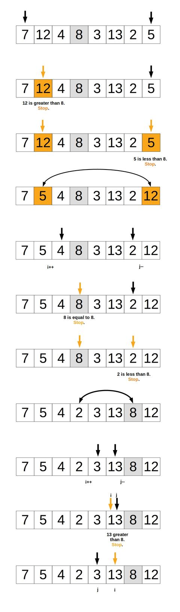
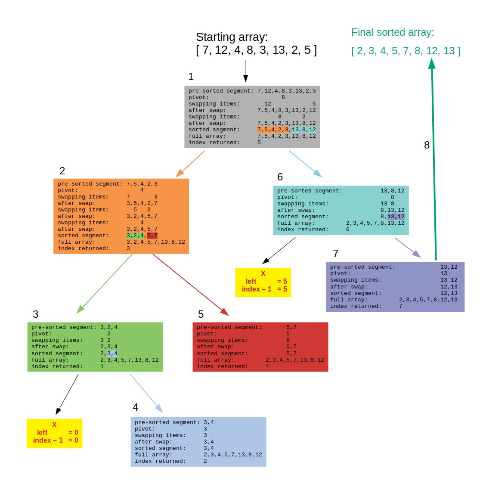

# Quick Sort

## Description

Another algorithm that uses a divide and conquer approach to sort a list (array) by recursively partitioning and sorting it. The array is changed in place (ie. mutated).

## Implementation

### Helper Function

#### Description

The helper function is used to partition and sort a segment of the array. While there are several ways to implement this helper function, this implementation uses Hoare's partition method: A method using two converging pointers to sort elements on either side of the pivot. Each segment will be partitioned in the middle to avoid the performance issue with sorting a pre-sorted array.

#### Overview

Given any segment of an array, a pivot point in the middle of said segment, a left pointer and a right pointer at each ends, sorts the elements smaller than the pivot point to the left and greater than the pivot point to the right.

Returns an index to be used on the next call to set the boundary of the next segment of the array to work on.

#### Pseudocode

- Set a `pivot` variable at the half way point of the segment of the array we’re working on.
- Set indices which will be used as pointers starting from the leftmost array segment item going towards the `pivot` point and starting from the rightmost array segment item going toward the `pivot` point.
- We initiate a while loop that starts at `i` and `j`’s initial values (which when partition is first invoked, are 0 and arr.length - 1, respectively).
- The `i` loop will run until it finds an improperly sorted item relative to its side of the partition, that is an element larger than the pivot and sitting on the left side. This loop continues while the value of the current array element is smaller than or equal to the pivot value.
- The `j` loop will run until it finds and improperly sorted item relative to its side of the partition, that is an element smaller than the pivot and sitting on the right side. This loop continues while the value of the current array element is larger than or equal to the pivot value.
- Once booth loops have stopped, a check occurs to see if the element at the `i` index is smaller than or equal the element at the `j` index. If this is true then we must swap because the elements are misplaced in the current segment of the array.
- Increment `i` and decrement `j` to continue converging on the pivot point from both sides.
- Repeat until the outermost loop condition is no longer true and return the `i` index. This index will determine where to start the partition on the next recursive call to the partition function.

#### Code

```javascript
function swap(arr, i, j) {
  let temp = arr[i];
  arr[i] = arr[j];
  arr[j] = temp;
}

function partition(arr, left, right) {
  let pivot = arr[Math.floor((left + right) / 2)];
  let i = left;
  let j = right;

  while (i <= j) {
    while (arr[i] < pivot) {
      i++;
    }

    while (arr[j] > pivot) {
      j--;
    }

    if (i <= j) {
      swap(arr, i, j);
      i++;
      j--;
    }
  }

  return i;
}
```

#### Diagram



### Quick Sort

#### Description

Partitions and sorts the array recursively while the entire array has not yet been fully sorted.

#### Overview

On each call to quickSort we first create an initial partition. Then we check if the left side of the partition has more than than one element. If true partition the left side. Then the same same process happens for the right side. Finally, return the array.

#### Pseudocode

- First, for simplification, set the default parameters to be able to invoke the function by only passing an array as a parameter. These will be `left = 0` and `right = arr.length - 1` on the first call.
- Short circuit: If array has less than two items, then it’s either empty or a single element array and both are always sorted. Simply return the array.
- Invoke partition for the segment of the array. This will partition the segment and return an `index` to partition both halves of that segment further.
- If left is less than `index-1` that means there exists a smaller segment of the array that the partition function has not sorted. Call quickSort (recursively) on the left side.
- If right is greater than `index`, there exists a smaller segment of the array that the partition function has not sorted. Call quickSort (recursively) on the right side.
- Return the array.

#### Code

```javascript
function quickSort(arr, left = 0, right = arr.length - 1) {
  if (arr.length < 2) return arr;

  let index = partition(arr, left, right);

  if (left < index - 1) {
    quickSort(arr, left, index - 1);
  }
  if (right > index) {
    quickSort(arr, index, right);
  }
  return arr;
}
```

#### Diagram



## Sources

- Code
  - [Computer science in JavaScript: Quicksort](https://humanwhocodes.com/blog/2012/11/27/computer-science-in-javascript-quicksort/), Nicholas C. Zakas, [License](../../licenses/license-1.md)
