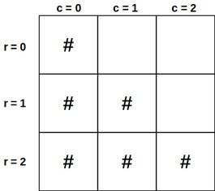

# Steps

A function that prints `n` number of steps using the `#` character. Spaces must come to the right and `n` must be a positive integer.

```javascript
// steps(2)
//
//  '#  '
//  '## '

// steps(3)
//
//  '#  '
//  '## '
//  '###'

// steps(4)
//
//  '#   '
//  '##  '
//  '### '
//  '####'
```

### Overview

If we look at the relationship between every column in a given row, we can see a pattern for which character should be at each position:

- At every row, if the index of the column (starting from 0), is less than or equal to the index of the row (starting from 0), then we add `#`. Otherwise, add a `space`.



### Code

```javascript
function steps(n) {
  for (let row = 0; row < n; row++) {
    let stair = "";

    for (let column = 0; column < n; column++) {
      if (column <= row) {
        stair += "#";
      } else {
        stair += " ";
      }
    }

    console.log(stair);
  }
}
```

### Recursive Solution

The function should take in three parameters: n, row and stair (the empty string being built up to represent a stair).

The function should recursively call itself until exit condition is met: n is equal to row (row will be 0 indexed). `Stair.length` will act as the index for each column.

At every call:

- Check for exit condition `n === row`
- If `n === stair.length` that is when have the entire row (stair) ready to be printed.
  - Print the stair
  - Call the function recursively starting at the next row. Start with an empty string.
- Otherwise check to see what character needs to be added to build the stair
  - If stair.length (column index) is less than or equal to row add `#`, else add a `space`
- Call the function recursively with the added character in the previous step

### Code

```javascript
function steps(n, row = 0, stair = "") {
  if (n === row) {
    return;
  }

  if (n === stair.length) {
    return steps(n, row + 1);
  }

  const char = stair.length <= row ? "#" : " ";
  steps(n, row, stair + char);
}
```
