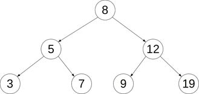
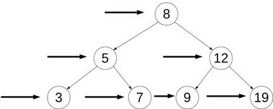
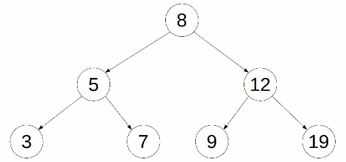

# Binary Search Tree

## What is a Binary Search Tree?

A binary search tree is a tree-like data structure with the following characteristics:

- It has a _single_ root node and child nodes
- Each node including the root can have a maximum of two child nodes
- Each node's left subtree node must have a value that is less than the parent
- Each node's right subtree node must have a value that is greater than the parent
- All nodes must have unique values



## Creating the Node Class

```javascript
class Node {
  constructor(val) {
    this.val = val;
    this.left = null;
    this.right = null;
  }
}
```

## Creating the Binary Search Tree Class

```javascript
class BinarySearchTree {
  constructor() {
    this.root = null;
  }
}
```

## Adding Methods

### Insert Method

#### Description

Insert a node by traversing the tree's subtrees in the correct order. Returns a boolean.

#### Implementation Overview

Create a new node and start at the root. If the value of the new node is less than that of the current node, then traverse left. If the value of the new node is larger than the current node, then traverse right. Continue until traversing either right or left leads to an empty position and insert at this position.

#### Pseudocode

- Create a new node
- If a root does not exist in the tree then set the new node as the root and return true.
- Start at the root by setting it as the current node
- Start a loop
  - If the value of new node is equal to the value of the current node, then the new node is a duplicate. Return `undefined`.
  - If the new node's value is less than the current node's value
    - If the current node's left child node is null, then insert the new node here and return true.
    - Else set the current node to be the that node's left child node.
  - If the new node's value is greater than the current node's value
    - If the current node's right child node is null, then insert the new node here and return true.
    - Else set the current node to be the that node's right child node.

#### Code

```javascript
  insert(val) {
    let newNode = new Node(val);
    if (this.root === null) {
      this.root = newNode;
      return this;
    }
    let currentNode = this.root;
    while (true) {
      if (val === currentNode.val) return undefined;
      if (newNode.val < currentNode.val) {
        if (currentNode.left === null) {
          currentNode.left = newNode;
          return this;
        }
        currentNode = currentNode.left
      }
      if (newNode.val > currentNode.val) {
        if (currentNode.right === null) {
          currentNode.right = newNode;
          return this;
        }
        currentNode = currentNode.right
      }
    }
  }
```

### Find Method

#### Description

Finds a node by traversing the tree's subtrees in the correct order. Returns a node.

#### Implementation Overview

Loop while while the tree can still be traversed and the node has no been found.

Starting at the root, if the value being searched is smaller than the current node's value, then traverse down the left subtree. If the value being searched is greater than the current node's value, then traverse down the right subtree.

If previous two conditions are not met and current is not null, then return the current node. If current is null return undefined.

#### Pseudocode

- If the root is `null` return false
- Create a variable `currrent` and set it as the root
- Create a variable `found` and set it to false
- While there is a current node (not `null`) and the value has not been found
  - If the value of the node is less than the value of the current node
    - Set `current` to `current.left` to traverse to the left subtree node
  - If the value of the node is greater than the value of the current node
    - Set `current` to `current.right` to traverse to the right subtree node
  - Else, the node has been found. Set `found = true`
- If the loop has ended and the node was no found, `return undefined`
- Return the current node.

#### Code

```javascript
  find(val) {
    if (this.root === null) return false;
    var current = this.root,
      found = false;
    while (current && !found) {
      if (val < current.val) {
        current = current.left;
      } else if (val > current.val) {
        current = current.right;
      } else {
        found = true;
      }
    }
    if (!found) return undefined;
    return current;
  }
```

## Traversal

To traverse a binary search tree we can take two approaches:

- Breadth first search
  - Traverses each level of the tree horizontal
- Depth first search
  - First, traverses the left subtrees vertically (all the way to the furthest branch), then traverses the right subtrees at each level

#### Breath First Search



#### Depth First Search



### Breadth First Search

#### Description

Traverses the tree horizontally. Returns an array showing the ordered path traversal.

#### Implementation Overview

For simplicity, the queue used in this method will be an array and its methods will be the associated array methods.

Create a queue to keep track of the child nodes of each parent node.

Starting from the root, push each node into the queue and then remove it and place it into another array (data). Add its left and right child elements to the queue. Continue inserting and removing from this queue until it is empty.

Return the data array.

#### Pseudocode

- Start at the root node by saving it as the `node` variable.
- Create a `queue` array and a `data` array to "log" the traversed path
- Push `node` into the queue
- While `queue` still has elements:
  - Use the shift method and set the `node` as its return value
  - Push the value of the node into `data`
  - If the node has a left child, add it to the queue
  - If the node has a right child, add it to the queue
- Return `data`.

#### Code

```javascript
  bfs() {
    let node = this.root;
    const queue = [];
    const data = [];
    queue.push(node);

    while (queue.length) {
      node = queue.shift();
      data.push(node.val);
      if (node.left) queue.push(node.left);
      if (node.right) queue.push(node.right);
    }
    return data;
  }

```
