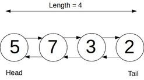

# Doubly Linked List

## What is a Doubly linked list?

A DLL is a data structure consisting of a sequence of nodes (objects) that have a a _two way_ link to other nodes.

They have a head, tail and length property.



## Creating the Node Class

```javascript
class Node {
  constructor(val) {
    this.val = val;
    this.next = null;
    this.prev = null;
  }
}
```

## Creating the Doubly Linked List Class

```javascript
class DoublyLinkedList {
  constructor() {
    this.head = null;
    this.tail = null;
    this.length = 0;
  }
}
```

## Adding Methods

### Push Method

Adds a new node to the end of the list. Returns the list.

#### Implementation Overview

If no tail exists set, tail to newly created node. If a tail already exists, sets the tail to be the newly created node.

#### Pseudocode

- Create a new node.
- If no tail exists in the list, then it is empty. Set the head and tail to be the new node.
- Else
  - Set the current tail to be the new tail
  - Set the new node's `prev` property to be the current tail
  - Set the tail to be the new node.
- Increment length
- Return the list.

#### Code

```javascript
  push(val) {
    const newNode = new Node(val);
    if (!this.tail) {
      this.head = newNode;
      this.tail = newNode;
    } else {
      this.tail.next = newNode;
      newNode.prev = this.tail;
      this.tail = newNode;
    }
    this.length++
    return this;
  }
```

### Pop Method

Removes the node at the end of the list. Returns the removed node.

#### Implementation Overview

Set the second to last item as the tail. Sever the link to the list of the old tail.

#### Pseudocode

- If no tail exists in the list, then it is empty. Return undefined.
- Save the old tail to a variable.
- If `list.length === 1`
  - Set head and tail to null
- Else
  - Set the tail to be the the old tail's prev property
  - Set that new tail's next property to be null to sever its link to the old tail
  - Set the old tails prev property to null to sever its link to the list
- Increment length
- Return the old tail.

#### Code

```javascript
  pop() {
    if (!this.tail) return undefined;
    let oldTail = this.tail;
    if (this.length === 1) {
      this.head = null;
      this.tail = null;
    } else {
      this.tail = oldTail.prev;
      this.tail.next = null;
      oldTail.prev = null;
    }
    this.length--;
    return oldTail;
  }

```

### Shift Method

Removes the node at the start of the list. Returns the removed node.

#### Implementation Overview

Set the second to first item as the head. Sever the link of the new head to the old and the old head to the list.

#### Pseudocode

- If no head exists, then the list is empty. Return undefined.
- Save the old head in a variable.
- If `list.length === 1`
  - Set head and tail to null
- Else
  - Set the head to be the old tail's next property
  - Set the new head's prev property to null
  - Set the old head's next property to null
- Decrement length
- Return the old head.

#### Code

```javascript
  shift() {
    if (!this.head) return undefined;
    let oldHead = this.head;
    if (this.length === 1) {
      this.head = null;
      this.tail = null;
    } else {
      this.head = oldHead.next;
      this.head.prev = null;
      oldHead.next = null;
    }
    this.length--;
    return oldHead;
  }
```
