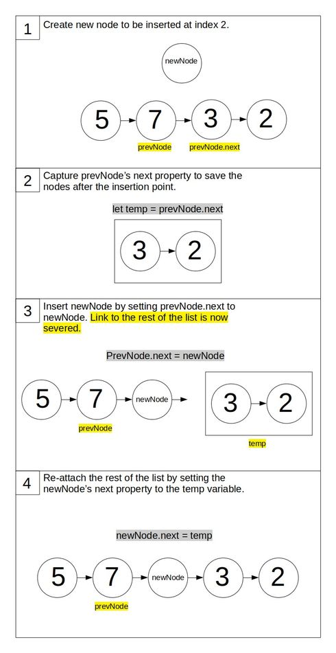
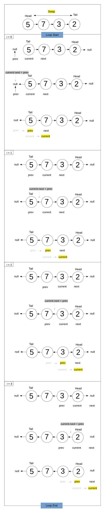

# Singly Linked List

## What is a Singly Linked List?

A SLL is a data structure consisting of a sequence of nodes (objects) that have a _one way_ link to another node.

They have a head, tail and length property.


### Creating the Node Class

The node class should have a value and a pointer property called "next" that points to the next node in the list.

```javascript
class Node {
  constructor(value, next) {
    this.value = value;
    this.next = null;
  }
}
```

### Creating the Singly Linked List Class

```javascript
class SinglyLinkedList {
  constructor() {
    this.head = null;
    this.tail = null;
    this.length = 0;
  }
}
```

## Adding Methods

### Push Method

Adds a new node to the end of the list. Returns the list.

#### Implementation Overview

If no tail exists set tail to newly created node. If a tail already exists, set the tail to be the newly created node.

#### Pseudocode

- First, create a new node.
- If the linked list is empty, then simply set the head and tail properties to be the new node. Increment length.
- Otherwise set the new node to be the current tail's next property, then set the tail of the list as the new node.
- Increment length and return the list.

#### Code

```javascript
push(val) {
    var newNode = new Node(val);
    if (!this.head) {
      this.head = newNode;
      this.tail = this.head;
    } else {
      this.tail.next = newNode;
      this.tail = newNode;
    }
    this.length++;
    return this;
  }
```

### Pop Method

Removes the node at the end of the list. Returns the removed node.

#### Implementation Overview:

Sever the link to the current tail and set the node previous to it as the new tail.

#### Pseudocode

- First if there is no head, then the list is empty, simply return undefined.
- Create a `current` variable and set it to the head (this.head).
- Create a `newTail` variable and set it to current.
- Loop while there is a `current.next`, that is `current.next` is not null, thus traversing till we're one node before the tail (whose next property is always null).
  - To traverse:
    - set `newTail = current`
    - set `current = current.next`
- Set `this.tail = newTail` (newTail will be one node before the)
- Set `this.tail.next = null`, effectively severing the previous tail.
- Decrement `this.length`
- If `this.length === 0`, we no longer have nodes in the list so we need to reset `this.head` and `this.tail`
- Return `current`, the popped node.

#### Code

```javascript
pop() {
    if (!this.head) return undefined;
    var current = this.head;
    var newTail = current;
    while (current.next) {
      newTail = current;
      current = current.next;
    }
    this.tail = newTail;
    this.tail.next = null;
    this.length--;
    if (this.length === 0) {
      this.head = null;
      this.tail = null;
    }
    return current;
  }
```

### Shift Method

Removes the node at the start of the list. Returns the removed node.

#### Implementation Overview

Set the current head's next node property as the head.

#### Pseudocode

- If there is no head the list has no nodes, return undefined.
- Create a currentHead variable and set it to this.head. This variable will save the current head so we may return it.
- Set `this.head = currentHead.next`
- Decrement length
- Check to see if length is now zero. If so, set `this.tail = null`
- return currentHead (the removed node).

#### Code

```javascript
shift() {
    if (!this.head) return undefined;
    let currentHead = this.head;
    this.head = currentHead.next;
    this.length--;
    if (this.length === 0) {
      this.tail = null;
    }
    return currentHead;
  }
```

### Unshift Method

Adds a new node to the beginning of the list. Returns the list.

#### Implementation Overview

Create a new node and sets its next property to be the current head. Set the list's head as this new node.

#### Pseudocode

- Create a new node and set to a variable called newHead.
- If there is no head in the list, then it is empty. Set `this.head` and `this.tail` to be newHead.
- Else
  - the newHead's next property should point to current head: `newHead.next = this.head`.
  - The list's head property should now be set to newNode.
- Increment the length
- Return the list

#### Code

```javascript
  unshift(val) {
    const newHead = new Node(val);
    if (!this.head) {
      this.head = newHead;
      this.tail = newHead;
    } else {
      newHead.next = this.head;
      this.head = newHead;
    }
    this.length++;
    return this;
  }
```

### Get Method

Returns a node at a given index.

#### Implementation Overview

Traverse to the node at the index by exploiting the fact that each node has a link to the next node. Using a loop and an incrementing counter variable, we start by initiating a `current` node variable to the list's head, and traverse forward by setting `current` to its `current.next` property until we arrive at the specified index.

#### Pseudocode

- If index is less than zero or greater than length of the list, then the index is in an invalid range. Return undefined.
- Create and initiate a counter variable at 0, `counter = 0`.
- Create a current variable and initiate at the list's head.
- Loop while counter hasn't reached index
  - Set current to current's _next property_ to traverse forwards.
  - Increment the counter.
- Return current

#### Code

```javascript
  get(index) {
    if (index < 0 || index >= this.length) return undefined;
    let counter = 0;
    let current = this.head;
    while (counter < index) {
      current = current.next;
      counter++
    }
    return current;
  }
```

### Set Method

Sets a new value at a specified node. Returns true if updated, false if node doesn't exist.

#### Implementation Overview

Use the get method to return node at given index. Update the node's value.

#### Pseudocode

- Create a new node variable and set it to the return value of calling `this.get(index)`
- If the returned value is falsy, return false
- Else update the node's value with the one passed in
- Return true.

#### Code

```javascript
  set(val, index) {
    let node = this.get(index);
    if (!node) return false;
    node.value = val;
    return true;
  }
```

### Insert Method

Inserts a new node at a given index. Returns boolean.

#### Implementation Overview

First capture the next property of the node before the index we're inserting to in a temporary variable. Insert the new node by setting that same previous node's next property to the new node. Point the new node's next property to the temporary variable which holds the rest of the list.

#### Pseudocode

- If index is less than zero or greater than length return false.
- If index is equal to list's length, use the list's push method. Coerce the returned value to a boolean using !!.
- If index is equal to zero use the lists unshift method. Coerce the returned value to a boolean using !!.
- Create a new node and set to variable `newNode`
- Set the node before the index we're inserting to a variable `prevNode`
- Capture `prevNode.next` in a `temp` variable to save a link to the nodes after the insertion point.
- Set `prevNode.next = newNode`. Link to the rest of the list in `temp` is severed.
- Set `newNode.next = temp` to re-establish link to part of the list that was severed.
- Increment length
- Return true.

#### Code

```javascript
  insert(val, index) {
    if (index < 0 || index > this.length) return false;
    if (index === this.length) return !!this.push(val);
    if (index === 0) return !!this.unshift(val);

    let newNode = new Node(val);
    let prevNode = this.get(index - 1);
    let temp = prevNode.next;
    prevNode.next = newNode;
    newNode.next = temp;

    this.length++
    return true
  }
```

#### Diagram



### Remove Method

Removes node and specified index. Returns removed node;

#### Implementation Overview

Traverse to the node preceding the node to be removed. Capture the node to be removed's next property (in a variable). Attach the previous node's next property to the removed node's next property. This will sever the removed node from the list's link chain.

#### Pseudocode

- If `index` is less than 0 or less than length - 1, then return undefined.
- If `index === 0`, use the already defined shift method and return value from function invokation.
- If index === this.length -1, use the already defined pop method and return value from function invokation.
- Create a `prevNode` variable and set to node preceding node we want to remove.
- Create a `removedNode` variable and set to `prevNode.next`.
- set `prevNode.next` equal to `removedNode.next` to point at the node after the removed node, thereby severing it from the link chain.
- Decrement length
- Return removed node.

#### Code

```javascript
  remove(index) {
    if (index < 0 || index > this.length - 1) return undefined;
    if (index === 0) return this.shift();
    if (index === this.length - 1) return this.pop();

    const prevNode = this.get(index - 1);
    const removedNode = prevNode.next;
    prevNode.next = removedNode.next;
    this.length--;
    return removedNode;
  }
```

### Reverse Method

Reverses the order of the nodes in the list. Returns the list.

#### Implementation Overview

Start by swapping the head and tail nodes. Set a current node as the head, previous node as null. Loop over each node. At every loop: first capture the next node in a variable, point currentNode's next property to the previous node. Then set the previous node to the current node and current node to the next node for the next loop. See diagram below for an example.

#### Pseudocode

- Create a current variable and set as `this.head`
- Swap `this.head` and `this.tail` using `current` as the temporary swapping variable.
- Initiate a `next` variable
- Initiate a `prev` variable and set to null
- Start a for loop
  - Set `next = current.next` to save the next node
  - Set `current.next = prev`
  - Set `current = next`
- Return list.

#### Code

```javascript
  reverse() {
    let current = this.head;
    this.head = this.tail;
    this.tail = current;

    let next;
    let prev = null;

    for (let i = 0; i < this.length; i++) {
      next = current.next;
      current.next = prev;

      prev = current;
      current = next;
    }
    return this;
  }
```

#### Diagram


