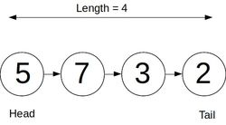

# Singly Linked List

## What is a singly linked list?

A SLL is a data structure consisting of a sequence of nodes (objects) that have a link to another node.

They have a head, tail and length property.



### Creating the Node Class

The node class should have a value and a pointer property called "next" that points to the next node in the list.

```javascript
class Node {
  constructor(value, next) {
    this.value = value;
    this.next = null;
  }
}
```

### Creating the Singly Linked List Class

As mentioned a singly linked list should have a head tail and length property.

```javascript
class SinglyLinkedList {
  constructor() {
    this.head = null;
    this.tail = null;
    this.length = 0;
  }
}
```

## Adding Methods

### Push Method

Adds a new node to the end of the list. Returns the list.

#### Overview

Set a tail property to the new node.

#### Pseudocode

- First, create a new node.
- If the linked list is empty, then simply set the head and tail properties to be the new node. Increment length.
- Otherwise the set the new node to be the current tail's next property, then set the tail of the list as the new node.

Increment length and return the list.

```javascript
push(val) {
    var newNode = new Node(val);
    if (!this.head) {
      this.head = newNode;
      this.tail = this.head;
    } else {
      this.tail.next = newNode;
      this.tail = newNode;
    }
    this.length++;
    return this;
  }
```

### Pop Method

Removes the node at the end of the list. Returns the removed node.

#### Overview:

To do this we must sever the link to the current tail and set the node previous to it as the new tail.

#### Pseudocode

- First if there is no head, then the list is empty, simply return undefined.
- Create a `current` variable and set it to the head (this.head).
- Create a `newTail` variable and set it to current.
- Loop while there is a `current.next`, that is `current.next` is not null, thus traversing till we're one node before the tail (whose next property is always null).
  - To traverse:
    - set `newTail = current`
    - set `current = current.next`
- Set `this.tail = newTail` (newTail will be one node before the)
- Set `this.tail.next = null`, effectively severing the previous tail.
- Decrement `this.length`
- If `this.length === 0`, we no longer have nodes in the list so we need to reset `this.head` and `this.tail`
- Return `current`, the popped node.

#### Code

```javascript
pop() {
    if (!this.head) return undefined;
    var current = this.head;
    var newTail = current;
    while (current.next) {
      newTail = current;
      current = current.next;
    }
    this.tail = newTail;
    this.tail.next = null;
    this.length--;
    if (this.length === 0) {
      this.head = null;
      this.tail = null;
    }
    return current;
  }
```

### Shift Method

Removes a node from the beginning of the list. Returns the removed node.

#### Overview

Set the current head's next node property as the head.

#### Pseudocode

- If there is no head the list has no nodes, return undefined.
- Create a currentHead variable and set it to this.head. This variable will save the current head so we may return it.
- Set `this.head = currentHead.next`
- Decrement length
- Check to see if length is now zero. If so, set `this.tail = null`
- return currentHead (the removed node).

#### Code

```javascript
shift() {
    if (!this.head) return undefined;
    let currentHead = this.head;
    this.head = currentHead.next;
    this.length--;
    if (this.length === 0) {
      this.tail = null;
    }
    return currentHead;
  }
```
